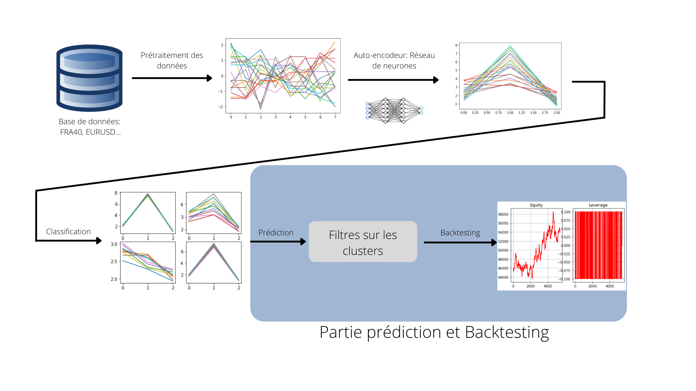

# Times Series Patterns Classification for Market Prediction
The goal of this project is to predict the variation of time series, in particular
the example of stock market indexes, using unsupervised learning 
approaches.

The prediction model starts by training on a dataset extracted from the database available
after the preprocessing and autoencoder stage. The goal of these two steps is to try to 
optimize as much as possible the learning of the classification model that will come 
afterwards. The classifier is based on the "Kmeans++" algorithm which we tried to improve
by taking several classifiers and making refinements between their respective centroids.
We succeeded in showing that this approach can converge with more than 25 refinement 
iterations. 

Once the final classifier is ready, we proceed by filters on the obtained clusters.
These filters are based on economic approaches to make the model more relevant. 
Finally we can do the backtesting to see how relevant the model is, it could also 
be used as a prediction tool of stock prices.

### Instructions for use:
The project is divided into several codes depending on the part in question. But to run the
prediction algorithm, you must first install the following libraries: pandas, matplotlib, 
keras, tensorflow, numpy, sklearn and fpdf; an easy way to do it is to use 
the `pip install package` command, replacing package each time with the library to be 
installed. Then you just have to use the `main.py` file by choosing the appropriate 
parameters:

- `path`: It must be the path containing the database
- `index0` : It takes two values: 'NON_FOREX' or 'FOREX' 
- `index` : The index to be predicted
- `date_start` : The start date of training that must be in that form "%Y-%M-%D %H-%M-%S"
- `date_end_train` : The end date of training that must be in that form "%Y-%M-%D %H-%M-%S"
- `date_end_test` : The end date of the backtesting step that must be in that form"%Y-%M-%D %H-%M-%S"
- `longueur` : the length of the data sequence used to do the classification
- `echantillon` : The interval from which we draw the sequence of points

Once the program finishes its execution, it creates a pdf file on the same  `path` 
containing the backtesting results for the time periods indicated before.

